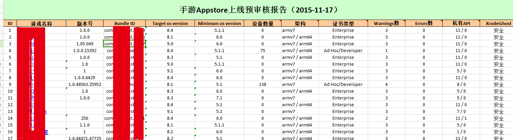
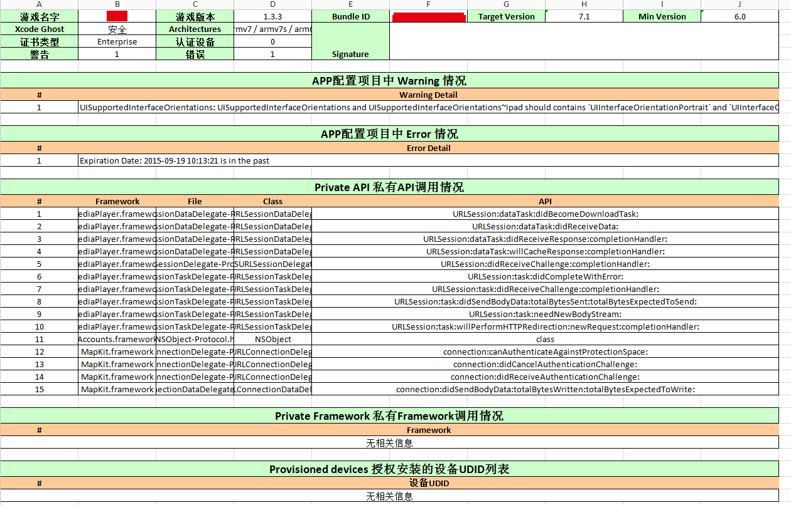

## iOS私有API检查工具 ##

私有API检查的原因在于：苹果在app提审的时候，会检查app使用私有api的情况，对于使用了私有api的app，不予通过，这个工具的目地就是在提审之前检查一下，提高通过率。

***PS:代码写的一般，主要是在做工具功能，欢迎PR。***

### 一、功能 ###

目前功能主要有以下：

1. 从ipa中提取一些基本信息，例如app名字，sdk版本，包名等，可以辅助QA日常工作。
2. ipa架构检查，可以看出是否支持64位架构，可以辅助AppStore提审。
3. ipa使用私有api情况，可以辅助AppStore提审。
4. ipa info和provision配置项的检查，获得授权设备udid（参考项目iOS-checkIPA）。
5. 获取签名信息。
6. 批量检查APP，并生成excel报告，截图见下方。

### 二、如何使用 ###

#### 1. 构建私有api库 ####

 - db/dsidx_dbs.py文件为解析docSet.dsidx的库，请实现将docSet.dsidx内容导出到sqlite中。docSet.dsidx是xcode作为代码提示的数据库，表示是apple公开的公有api。

 - 修改config.py中sdks_config字典，增加各个version的sdk路径，然后运行build_api_db.py，会自动解析私有api，存存储到sqlite中。

 - (项目中的数据库内容是我编译sdk7.0的数据，可以直接用。)

#### 2. 检查ipa私有api ####

运行方式有二，建议第二种web方式：

1. 修改iOS_private.py main方法中的ipa路径，运行即可。

2. 使用Web上传运行的方式，运行python run_web.py（请先配置flask运行环境），然后浏览器输入127.0.0.1:9527 将ipa拖入上传框等待即可看到检查结果。

3. 使用batch_check方法批量运行目录中的ipa，并生成excel报告。

### 三、Screenshot ###

 - 网页检查展示

 - 批量检测生成excel报告概要

 - excel报告详细页

### 四、参考项目 ###

 - [iOS-private-api-scanner](https://github.com/mrmign/iOS-private-api-scanner)
 - [RuntimeBrowser](https://github.com/nst/RuntimeBrowser/tree/master/tools/ios_headers_history)
 - [XlsxWriter](https://github.com/jmcnamara/XlsxWriter)
 - [iOS-checkIPA](https://github.com/apperian/iOS-checkIPA)
 - [iOS-api-scan.md](https://github.com/mrmign/iOS-private-api-scanner/blob/master/iOS-api-scan.md)

### 五、Note ###

1. `私有的api ＝ (class-dump Framework下的库生成的头文件中的api - (Framework下的头文件里的api = 有文档的api + 没有文档的api)) + PrivateFramework下的api`。
2. 私有api在公开的Framework及私有的PrivateFramework都有。
3. 请暂时暂mac上运行，linux上暂时没有找到合适的、代替otool的工具，求推荐^^!

## License

This code is distributed under the terms and conditions of the GPL v2 license.
